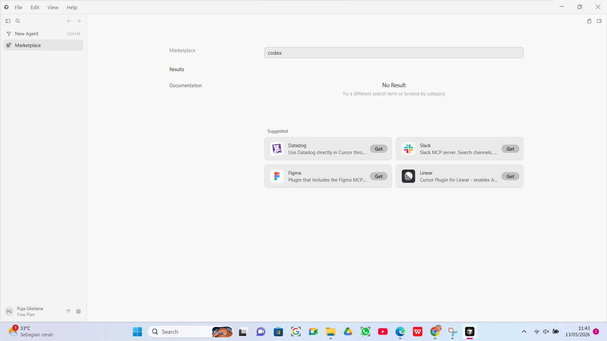
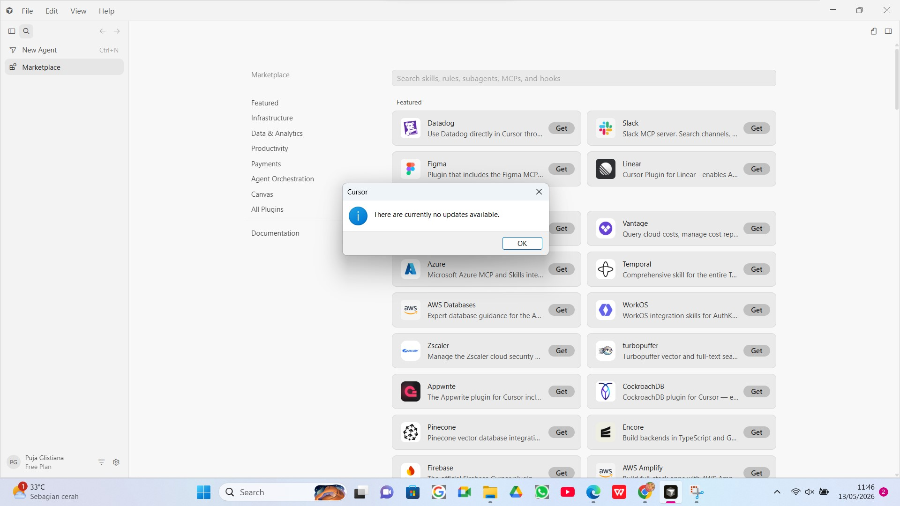
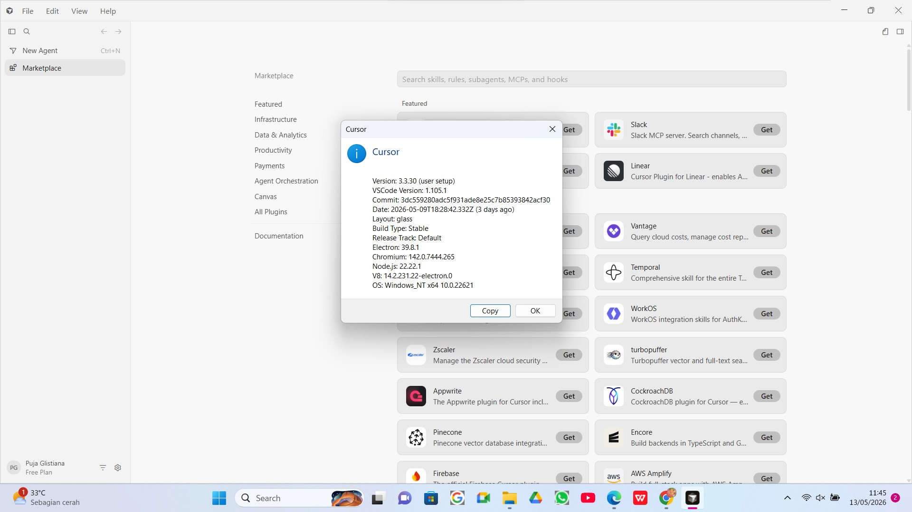
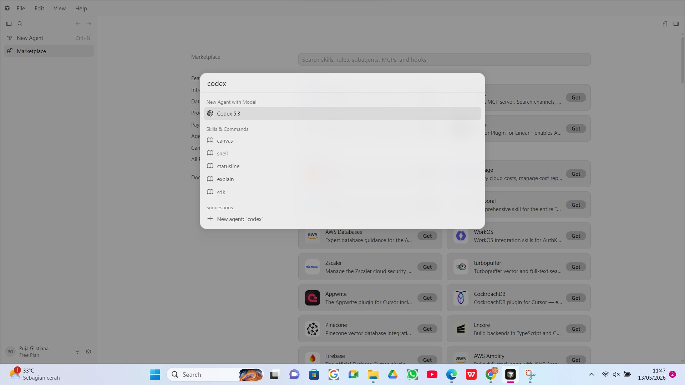
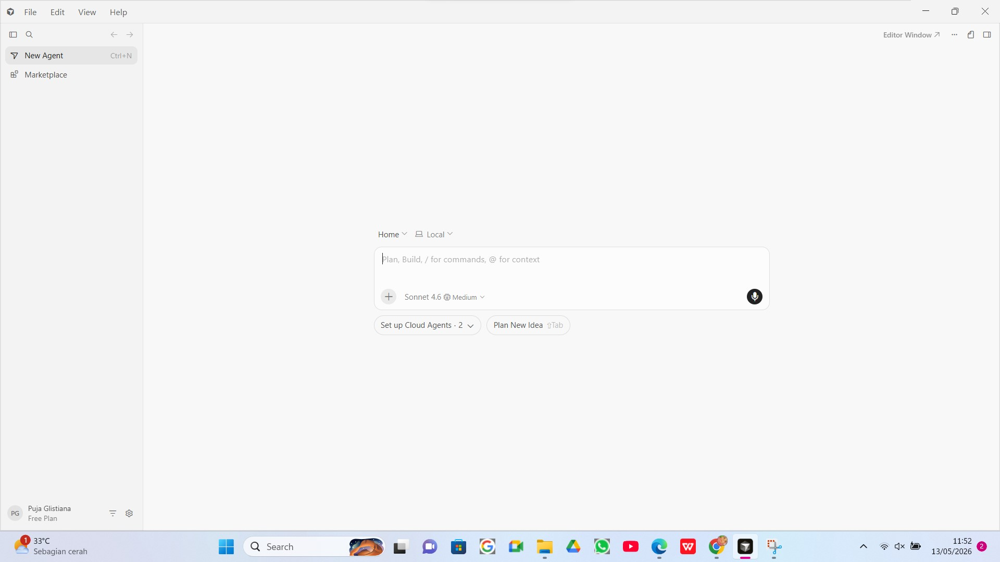

# AI Tools Setup Portfolio

## Introduction
This repository documents my setup process for AI tools and workflow environments using Cursor and GitHub. 

The goal of this project was to explore modern AI-powered development tools, understand how the latest Cursor environment works, and document the overall setup experience.

## Tools Used
- Cursor IDE
- OpenAI Codex 5.3
- Claude Sonnet 4.6
- Claude Opus 4.7
- GitHub

## Setup Process
1. Installed Cursor IDE on Windows
2. Logged into Cursor and connected my GitHub account
3. Explored Cursor’s updated interface and marketplace system
4. Searched for Claude and Codex integrations
5. Discovered that the latest Cursor version already provides built-in AI model access
6. Successfully accessed and tested Codex and Claude models directly inside Cursor
7. Created this public GitHub repository to document the process

## Challenges I Ran Into
At first, I tried searching for “Claude Code” and “Codex” as downloadable extensions because that was what the original instructions mentioned.

However, after exploring the latest version of Cursor, I realized that these AI models are now integrated directly into the platform instead of being installed separately through extensions.

After checking the current Cursor version and experimenting with the interface, I was able to access both Claude and Codex successfully through Cursor’s built-in AI system.

## What I Learned
- How modern AI workflows are integrated into development environments
- Basic GitHub repository setup and documentation
- How to adapt when software interfaces or workflows have changed
- The importance of researching and troubleshooting independently

## Screenshots

### Marketplace Search

### Cursor Update Check

### Cursor Version

### Codex Search

### Codex Model Access

### Claude Sonnet Access

### Claude Opus Access

### Cursor Update Check

### Marketplace Search

